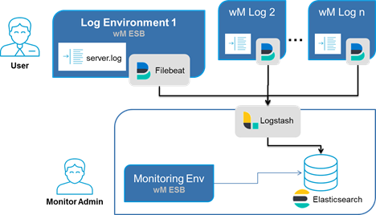

# WxMonitoring
WxMonitoring is a ready-to-use webMethods monitoring solution based on Open Elastic Stack (Elastic Search, Logstash, Filebeat), that provides rules-based log-file analysis and activity monitoring to optimize webMethods operations.

## Overview

If running multiple webMethods productive environments it becomes critical to keep track of exceptions in near-time and leverage operational costs. _WxMonitoring_ is a monitoring solution based on _Open Elastic Stack_, that provides a independent, centralized monitoring. It samples existing IS log-files and supports queries and aggregations views. Additionally automatized rule based actions allows you to react immediately after an exception occurs. They simply send mails, raise JIRA tickets or invoke a compensating service. Rules can be easily defined on existing los messages. For business users WxMonitoring provides views and reports on current and historical process executions.

For standalone installation you can simply import log files. This helps you to analyse logs from other environments without the need to be connected to. Together with purging data you can simulate different data sets.

### Features

* Dashboard (Overview Business Processes and Events)
* Searches on Events/Processes
* Aggreational View on Events
* Aggreational View on Processes
* Generate and Import Sample Data
* Import log files
* Purge Data

* Online Documentation

## Jump Start
Please download and use latest version (current: 0.2)
* [Download](dist/WxMonitoring-dist-0.2.zip) distribution package and unzip
* To getting started just see [Installation Guide](assets/IS/Packages/WxMonitoring/pub/docs/getting-started.md)

Further documentations

* [Release Notes](assets/IS/Packages/WxMonitoring/pub/docs/release-notes.md)
* [Roadmap](assets/IS/Packages/WxMonitoring/pub/docs/roadmap.md)
* [Users Guide](assets/IS/Packages/WxMonitoring/pub/docs/users-guide.md)
* [Development Guide](assets/IS/Packages/WxMonitoring/pub/docs/development-guide.md)

## Authors
[Marko Goerg](mailto:Marko.Goerg@softwareag.com)

[Puneet Arora](mailto:Puneet.Arora@softwareag.com)
______________________
These tools are provided as-is and without warranty or support. They do not constitute part of the Software AG product suite. Users are free to use, fork and modify them, subject to the license agreement. While Software AG welcomes contributions, we cannot guarantee to include every contribution in the master project.	

Contact us at [TECHcommunity](mailto:technologycommunity@softwareag.com?subject=Github/SoftwareAG) if you have any questions.
