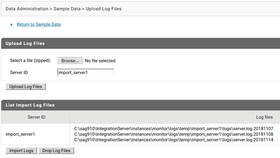
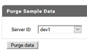
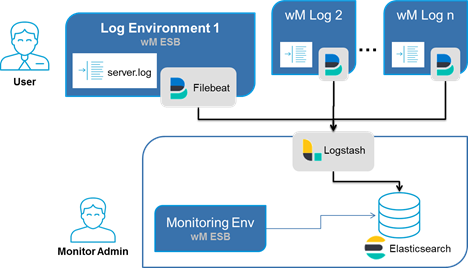

# WxMonitoring
WxMonitoring is a ready-to-use webMethods monitoring solution based on Open Elastic Stack (Elastic Search, Logstash, Filebeat), that provides rules-based log-file analysis and activity monitoring to optimize webMethods operations.

## Overview
If running multiple webMethods productive environments it becomes critical to keep track of exceptions in near-time and leverage operational costs. WxMonitoring is a monitoring solution based on Open Elastic Stack, that provides a independent, centralized monitoring. It samples existing IS log-files and supports queries and aggregations views. Additionally automatized rule based actions allows you to react immediately after an exception occurs. They simply send mails, raise JIRA tickets or invoke a compensating service. Rules can be easily defined on existing los messages. For business users WxMonitoring provides views and reports on current and historical process executions.

# Table of Contents

* [Features](#features)
* [Release Notes](#release-notes)
* [Getting started](#getting-started)
* [Users Guide](#users-guide)
* [Roadmap](#roadmap)
* [Development Guide](#development-guide)
* [About](#about)

## Features

* Dashboard
* Searches on Events/Processes
* Aggreational View on Events
* Aggreational View on Processes
* Generate and Import Sample Data
* Import log files
* Purge Data

## Release Notes

### 0.2

New features in 0.2:

* Import Log Files

* Purge Data

* Fix Dashboard


## Getting started



In this document “Log Environment“ refers to your webMethods environment that contain logs that are to be monitored. “Monitoring Environment” refers to a separate environment which will run WxMonitoring.

For simplification both log and monitoring environment can be installed on the same webMethods installation (e.g. in development). It is recommended to use separate monitoring environment for your Test/QA and Production stages.

WxMonitoring has been developed and tested with 9.10. It should work with webMethods 9.10+.

### Prerequisite:

WxMonitoring requires the installation of the following products
* **Logstash** (version: 6.2.x) is installed on “Monitoring Environment”. 
    Logstash installation guide : https://www.elastic.co/guide/en/logstash/current/installing-logstash.html
* **Elasticsearch** (version: 6.2.x) is installed on Monitoring Environment 
    Setting up ElasticSearch : https://www.elastic.co/guide/en/elastic-stack/6.2/installing-elastic-stack.html
* **webMethods 9.10+ Integration Server** / all concerned Log Environments, and Monitoring Environment
    Download WxMonitoring from Labcase https://labcase.softwareag.com/projects/wxmonitoring or TechCommunity
* **Filebeat** (at least version: 6.2.x) is installed on “Log Environment” server. 
    Filebeat installation guide : https://www.elastic.co/guide/en/beats/filebeat/current/filebeat-installation.html

### Monitoring Environment
1. Start Elasticsearch server
    * (e.g.) run %ES_HOME%/bin/elasticsearch.bat
1. Start Integration Server
    * (e.g.) run %SAG_HOME%/profiles/IS_default/bin/startup.bat
1. Install IS package WxMonitoring
1. Test installation
    * Open http://localhost:5555/WxMonitoring/
      You should see an empty search result page
    * Open http://localhost:9200/_cat/indices?v
      You should see indexes wxmonitoring-processes, wxmonitoring-events-original, wxmonitoring-events-xxxx.xx.xx, wxmonitoring-event-rules
1. Start Logstash
    * The following instruction describes how to start Logstash from command line. Please see below instructions how to start as a service (recommended in test/qa and prod environments)
    * Navigate to "...\packages\BG_Monitoring\pub\elk\logstash" directory
    * Edit file “startLogstash.cmd” and update correct paths for following variables
      SAG_HOME: path for software ag home folder (e.g. c:\SoftwareAG)
      LOGSTASH_HOME: path to logstash home folder (for e.g. C:\SoftwareAG\logstash-6.2.2)
      LOGSTASH_PORT: “5044” (default port - only change if needed)
      ELASTIC_SEARCH_ADDRESS: “localhost:9200” (default address - only change if needed)
    * Run “startLogstash.cmd”
    * Before proceeding, please verify logstash has successfully started by navigating to logstash logs (%LOGSTASH_HOME%/logs/logstash-plain) and verify following log has been recorded: 
      "[INFO ][org.logstash.beats.Server] Starting server on port: 5044"

### Log Environment
1. (opt.) Copy following files from WxMonitoring\pub\elk\filebeat to anywhere in log environment server.
   * startFilebeat.cmd
   * wxmonitoring_filebeat.yml
1. Starting Filebeat
   * The following instruction describes how to start Filebeat from command line. Please see below instructions how to start as a service (recommended in test/qa and prod environments)
   * Edit file “startFilebeat.cmd” and update correct paths for following variables
     SAG_HOME: path for software ag home folder (e.g. c:\SoftwareAG)
     FILEBEAT_HOME: write path to filebeat home folder (e.g. C:\SoftwareAG\filebeat-6.2.2)
     SERVER_ID: write name of this log environment (should be same as provided in the monitoring environment global variable MONITORED_SERVER_LIST, e.g. dev1)
     LOGSTASH_HOST: address URL of Logstash on monitoring environment (e.g. 127.0.0.1 or localhost)
     LOGSTASH_PORT: verify logstash port is correct (e.g. 5044)
     LOGFILE_PATH= write path of the log file that is to be monitored (e.g. C:\LOG_COLLECTION\sample_process_server.log)
1. Run “startFilebeat.cmd

### Test Installation
1. Navigate to IS_Server_base_url/wxmonitoring from browser and verify logs availability.
1. Test Elastic Search http://localhost:9200/_cat/indices?v 
1. See log files for Filebeat / LogStash


## Roadmap

All the following features should be implemented in future releases. 

* Documentation
    * API
    * Product Help
* Fulltext Search
    * on Events
    * on Processes
* Refactoring Monitoring API
* Release build automization (ANT/Gradle?-build)
* Docker support / installation

## Development Guide

ToDo ...

### Dashboard

### Import log files

### Purge data


### Interfaces

#### Filebeat

#### Logstash

```
input {
  beats {
    port => "${LOGSTASH_PORT:5044}"
  }
  http {
    port => "${LOGSTASH_HTTP_IMPORT_PORT:5045}"
  }
}
```

#### Beats

Logstash is listing on port :5044 to receive Beats log events.

#### Http

For debugging and importing events directly Logstash is listing on port :5045 to receive log events via REST.

Use this JSON-format to emit an message event:
```
{
"message":"2018-12-11 11:33:59 MEZ [ISS.0134.0058E] JMS Trigger test.wx.smoketest.services.edademo...",
"log_identifier":"server_log",
"source":"\\IS1\\server.log",
"fields":{
    "env":"esbtest"
}
}
```


### Data Structures

#### Indexes

| index | description | 
| ------------- | ------------- |
| wxmonitoring-events-original | |
| wxmonitoring-events-[yyyy.MM.dd] | |
| wxmonitoring-processes-original | |
| wxmonitoring-processes | |
| wxmonitoring-event-rules | |

#### Event 
```
{
"_index": "wxmonitoring-events-original",
"_type": "doc",
"_id": "Zw0qmmcBRr67D9-7nTXm",
"_score": 2.2693477,
"_source": {
    "event_tags": "ISS",
    "complete_event_log": "2018-05-01 00:02:40 MESZ [ISS.0015.0005D] Invoking service wm.server.ns:getNode.",
    "event_severity": "DEBUG",
    "log_identifier": "server_log",
    "event_identifier": "unknown_IS_event",
    "event_timestamp_utc": "2018-04-30 22:02:40",
    "host": "127.0.0.1",
    "log_time_zone": "MESZ",
    "event_information": "Invoking service wm.server.ns:getNode.",
    "@timestamp": "2018-12-10T22:09:02.703Z",
    "event_code": "ISS.0015.0005",
    "source": """\IS\server.log""",
    "event_env": "serverdid2"
    }
}
```

#### Process 
```
{
"_index": "wxmonitoring-processes",
"_type": "doc",
"_id": "202bb4e0-00e2-1a47-8335-fffffffe442c",
"_score": 1,
"_source": {
    "process_id": "202bb4e0-00e2-1a47-8335-fffffffe442c",
    "log_history": [
        "2018-11-08 14:39:34 MEZ [BPM.0102.0196I] 202bb4e0-00e2-1a47-8335-fffffffe442c:1, MID=WxSmoketestProcesses/SmokeTest3, MVer=1: process started",
        "2018-11-08 14:39:37 MEZ [BPM.0102.0199I] 202bb4e0-00e2-1a47-8335-fffffffe442c:1, MID=WxSmoketestProcesses/SmokeTest3, MVer=1: process failed"
    ],
    "MVer": "1",
    "offset": null,
    "started_timestamp_utc": "2018-11-08 13:39:34",
    "process_name": "SmokeTest3",
    "business_domain": "WxSmoketestProcesses",
    "current_status": "failed",
    "process_env": "serverid1",
    "source": """\IS\server.log""",
    "process_instance": "1",
    "last_updated_utc": "2018-11-08 13:39:37",
    "failed_timestamp_utc": "2018-11-08 13:39:37",
    "event_tags": [
        "BPM"
    ]
}
}
```

### Design

### Coding Conventions

### Code Checks

* dependency checks
* usage of external services
* coding conventions
* ...

#### webMethods Services

* wx.monitoring.services.gui.dashboard:getDashboard
    * wx.monitoring.services.gui.events:getEventsStats
        * wx.monitoring.services.admin:getEventsAgg
            * wx.monitoring.impl.maps:aggSourceToAggViewList
            * wx.monitoring.impl.persistence.handler:getESDocumentsByQuery
            * wx.monitoring.impl.persistence.queries.events:createGetEventAggQuery
    * wx.monitoring.services.gui.processes:getProcessesStats
        * wx.monitoring.services.admin:getProcessesAgg
            * wx.monitoring.impl.maps:aggSourceToAggViewList
            * wx.monitoring.impl.persistence.handler:**getESDocumentsByQuery**
                 * wx.monitoring.services.adapters.es:invokeElasticSearch
        * wx.monitoring.impl.persistence.queries.processes:createGetProcessAggQuery

## About

* Marko Goerg
* Puneet Arora