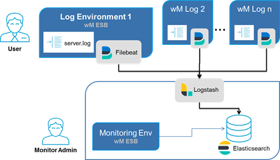

## Overview
WxMonitoring is a ready-to-use webMethods monitoring solution based on Open Elastic Stack (Elastic Search, Logstash, Filebeat), that provides rules-based log-file analysis and activity monitoring to optimize webMethods operations.

If running multiple webMethods productive environments it becomes critical to keep track of exceptions in near-time and leverage operational costs. _WxMonitoring_ is a monitoring solution based on _Open Elastic Stack_, that provides a independent, centralized monitoring. It samples existing IS log-files and supports queries and aggregations views. Additionally automatized rule based actions allows you to react immediately after an exception occurs. They simply send mails, raise JIRA tickets or invoke a compensating service. Rules can be easily defined on existing los messages. For business users WxMonitoring provides views and reports on current and historical process executions.

For standalone installation you can simply import log files. This helps you to analyse logs from other environments without the need to be connected to. Together with purging data you can simulate different data sets. 

_Log Environment_ refers to your webMethods environment that contain logs that are to be monitored. Monitoring Environment refers to a separate environment which will run WxMonitoring.

For simplification both log and monitoring environment can be installed on the same webMethods installation (e.g. in development). It is recommended to use separate monitoring environment for your Test/QA and Production stages.

WxMonitoring has been developed and tested with 9.10 on Win64. It should work with webMethods 9.10+.

### Features

* Dashboard (Overview Business Processes and Events)
* Searches on Events/Processes
* Aggreational View on Events
* Aggreational View on Processes
* Generate and Import Sample Data
* Import log files
* Purge Data

* Online Documentation
