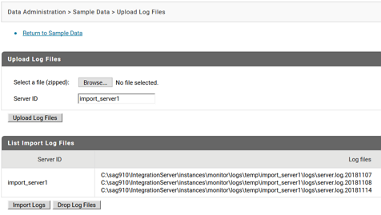

## Release Notes

| Release Date | Version | description (main feature)  | 
| -------------| ------- | --------------- |
| 2019-01-03   | 0.2     | import log data |
| 2018-11-23   | 0.1     | initial release |

### 0.2 (latest)

New features in 0.2:

* Import Log Files

    

* Purge Data

    

* Online Help 

    

* Fixes Dashboard
* Internal Service Refactorings

### 0.1 (initial)

Initial release for webMethods User Group

* first installation package
* available on github (https://github.com/SoftwareAG/WxMonitoring)