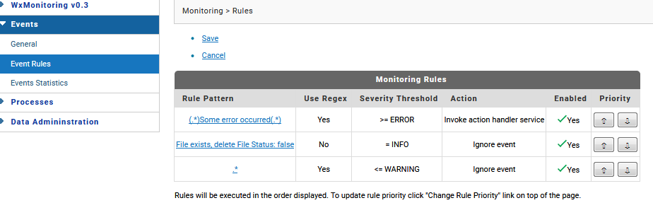

## User Guide

Still under construction ...

TODO !!

### Table of Contents

1. Features
    1. [Dashboard](#Dashboard)
    1. Event Rules
    1. Import Log Files
    1. Purge Data
    1. Online Help
1. Configuration
    1. WxMonitoring
    1. Logstash
    1. Filebeat
1. Installation as Windows service
    1. Logstash
    1. Filebeat

### Dashboard

### Event Rules
An important part of log monitoring is to be able to perform certain actions if a specific event occurs. For example an admin might want to be notified (via e-mail or via JIRA ticket creation) whenever a server logs an error event or he might simply want to ignore an event if it is of severity warning or info.
For this purpose WxMonitoring provides an event monitoring scheduler service that is created when WxMonitoring package is loaded by IS. In principle this service matches the recent events against the active rules. 


For events that match more than one rule, only the rule with highest priority is triggered. Rules are displayed in the UI according to priority with first rule being the highest priority rule. However, priority of the rules can be changed and set according to admin preference.



#### Setting Up a Rule

Rules can be added or edited as shown in the figure below.


#### Rule Execution
WxMonitoring package when loaded creates a schedular service called monitorEvents. This service is responsible to evaluate all events that occurred since the schedular last run. The events are evaluated based on event pattern set in rule and severity threshold described in the rule. If the event matches the rule then it performs the action which is to either "ignore event" or "invoke action handler service". The action handler service which is part of the WxMonitoring customer specific extension then has the liberty of performing any action based on the event type. For e.g Customer may implement a service to send an email to admin or create a JIRA ticket or call some other handler service. This action handler service implemented in customer extension must follow a strict WxMonitoring input interface which is created to provide event information and rule information that could be helpful in further implementation of the handler.

#### Import Log Files


#### Purge Data
   


#### Online Help 


### Configuration

#### WxMonitoring

Configuration of package WxMonitoring is based on IS _Global Variables_. On package load all global varibales will be created if unset. Changes will immediatly take place, so you don't need to reload the package.

| Key | Value (default) | Description |
| --- | --------------- | ----------- |
| ES_BASE_URL | http://localhost:9200 | connection / URL to elastic search server |
| LOGSTASH_BASE_URL | http://localhost:5045 | connnection /URL to logstash http port. Only needed to import data from monitoring UI |

#### Logstash

Logstash configuration is defined in `WxMonitoring.conf`.

```go
input {
  beats {
    port => "${LOGSTASH_PORT:5044}"
    client_inactivity_timeout => 3600
  }
  http {
    port => "${LOGSTASH_HTTP_IMPORT_PORT:5045}"
  }
}

filter {
...
}

output {
...
}
```

Logstash is listing on port :5044 to receive Beats log events (from Filebeat).

For debugging and importing events directly Logstash is listing on port :5045 to receive log events via REST.

Use this JSON-format to emit an message event:
```json
{
"message":"2018-12-11 11:33:59 MEZ [ISS.0134.0058E] JMS Trigger test.wx.smoketest.services.edademo...",
"log_identifier":"server_log",
"source":"\\IS1\\server.log",
"fields":{
    "env":"esbtest"
}
}
```

Please see logstash configuration for more detail on https://www.elastic.co/guide/en/logstash/6.2/configuration.html (or https://www.elastic.co/guide/en/logstash/6.2/plugins-inputs-beats.html for beats input config)

> **Hint**: 
> To avoid configuration overrides it is recommended to copy both startXXX.cmd and the configuration file into a separate `/bin` folder.

#### Filebeat

Filebeat configuration is defined in `WxMonitoring.yml`.

```yaml
filebeat.prospectors:
- type: log
...

processors:
...

fields:
...

output.logstash:
  # The Logstash hosts
  hosts: [ "${LOGSTASH_HOST}:${LOGSTASH_PORT}" ]
```

Please see filebeat configuration for more detail on https://www.elastic.co/guide/en/beats/filebeat/6.2/filebeat-configuration.html 

> **Hint**: 
> To avoid configuration overrides it is recommended to copy both startXXX.cmd and the configuration file into a separate `/bin` folder.


### Installation as Windows service

#### Logstash

To start Logstash as a service:
* Download nssm (https://nssm.cc/download) 
* Navigate to `default\packages\WxMonitoring\pub\elk\filebeat` directory.
* Edit file `install-wxmonitoring-logstash-service.bat` and update correct paths for following variables:
    * NSSM_PATH: provide actual path of NSSM downloaded in step 1 (e.g. `C:\Users\abc\Downloads\nssm-2.24\nssm-2.24\win64`)
    * Navigate to “default\packages\WxMonitoring\pub\elk” directory.
* Edit file `startLogstash.cmd` and update correct paths for following variables :
    * SAG_HOME: Verify provided relative path is correct or write the path for software ag home folder
    * LOGSTASH_HOME: write path to logstash home folder (e.g. C:\SoftwareAG910\logstash-6.2.2).
    * LOGSTASH_PORT: verify provided port is not used by any other application.
    * ELASTIC_SEARCH_ADDRESS:  Address for elasticSearch (e.g. localhost:9200)
* Run “install-WxMonitoring-logstash-service.bat”

#### Filebeat

To start filebeat as a service:
* Edit file `install-wxmonitoring-filebeat-service.ps1` and update correct paths for following variables:
    * filebeat_home: provide the home directory for filebeat.
* Edit file `WxMonitoring.yml` and update correct value (remove ${VARIABLE} and write its value) for following variables:
    * ${SERVER_ID}: write name of current log environment.
    * ${LOGSTASH_HOST}: address URL of logstash on monitoring environment (for e.g. 127.0.0.1 or localhost).
    * ${LOGSTASH_PORT}: verify logstash port is correct (for e.g. 5044).
    * ${LOGFILE_PATHx}: write path of the log file that is to be monitored (for e.g. `C:\SoftwareAG\IntegrationServer\instances\default\logs\server.log`). Please remove ${LOGFILE_PATH2} if only 1 file is to be monitored. You can also add more than 2 log files if the log file format is similar to IS server log or IS wrapper log.
* Run “install-wxmonitoring-filebeat-service.ps1” from windows powershell.
* Start the service “filebeat” (please make sure logstash is up and running)
